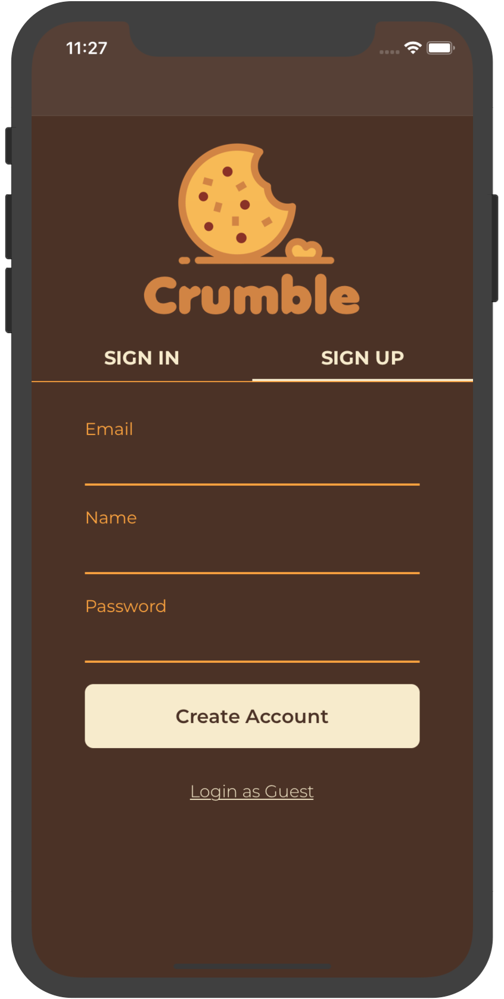
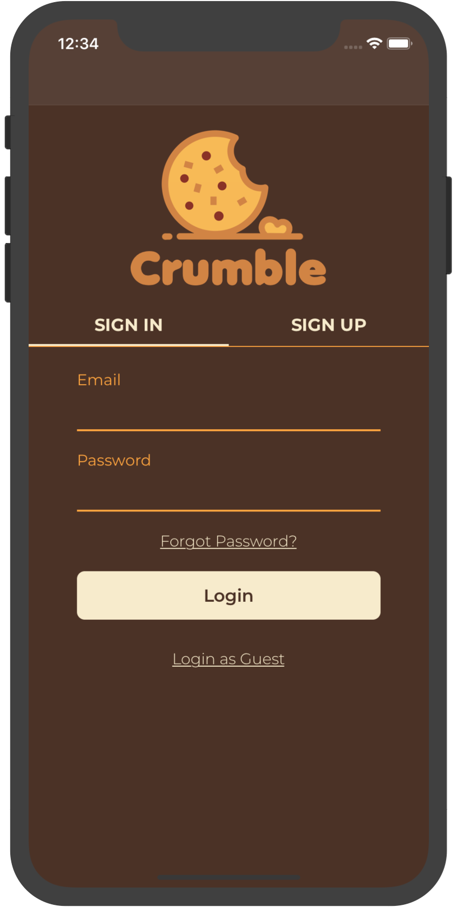
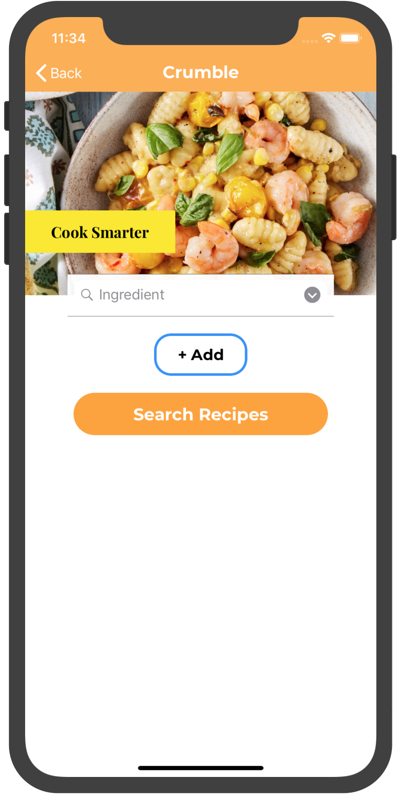
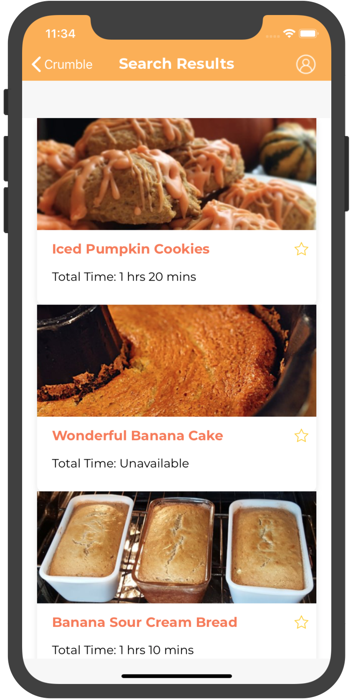
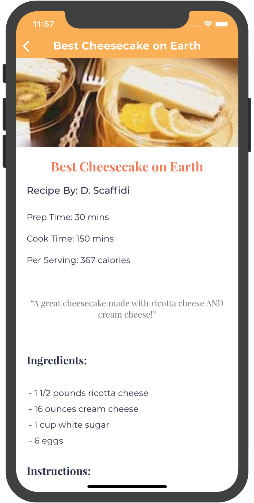
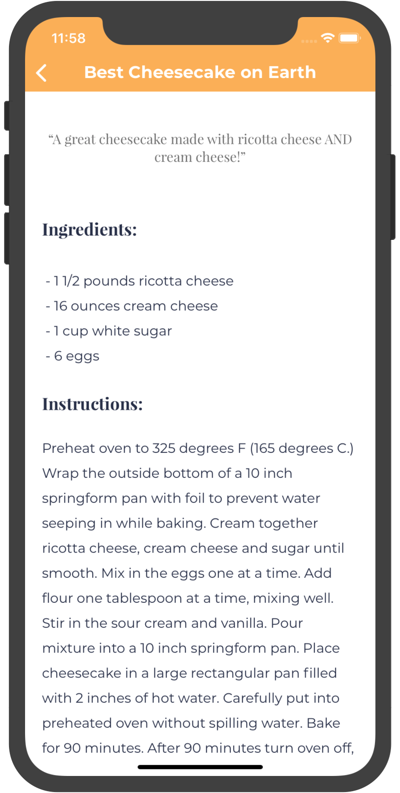

# Crumble
Cook smarter.

## Description
Search for recipes by filtering the results to match the ingredients you actually have. Sign up/login to favorite the recipes you love most and quickly find them again. Recipes include nutrition facts to help you keep track of metrics such as calories, fat, and cholesterol.

## iOS Requirements Met
- Autolayout using NSLayoutConstraint on all pages
- Search Page: includes a UISearchBar, UICollectionView to list all of the ingredients being used as filters
- Recipe Search Page: includes a UITableView of all recipes that fit the filters, and a UICollectionView of the filters being used
- Recipe Page: includes titles, authors, descriptions, ingredients list, and instructions for recipes
- UINavigationController used to navigate between login page, search page, recipe page, and profile page
  - Used when selecting "Search Recipes" button on main search page, when clicking on a recipe to see its information, and when clicking on the profile icon in the Navigation Bar
  - Includes a back button to return to the previous view controller
- Integration with recipe API

## Backend Requirements Met
- Multiple GET requests implemented:
  - get all recipes
  - get a particular recipe by ID
  - get a list of all ingredients in the database
  - get a particular ingredient by ID
  - get all tags in the database
  - get a user's favorites
  
- Multiple POST requests implemented:
  - make multiple recipes
  - make one recipe
  - 'favorite' a recipe
  - 'unfavorite' a recipe
  - register a new user
  - login an existing user
 
- DELETE request implemented:
  - delete a recipe from the database
  
- Implemented authenticaion using username/password with session ID's that expire and can be updated
- Implemented many-to-many relationships using association tables for:
  - recipes <-> ingredients
  - recipes <-> tags
  
- Implemented one-to-many relationship (to implement favorites):
  - user -> recipes

- Deployed to Google Cloud

## Additional Notes
- Some routes implemented in app.py were not actually used by the frontend and mostly there for testing (i.e, getting all ingredients in the database)
- All backend code can be found in the _crumble/backend_ directory
- A JSON of information for 100 recipes was scraped from allrecipes.com and used to create the database's recipes. The python script used to scrape the recipes is _step1.py_ and can be found in the _crumble_ directory
- Additional iOS features to the ones listed above were implemented (including SearchController and UIScrollView)
- Implementation of favoriting recipes on the front end is not completely finished. You can favorite and unfavorite a recipe in a given session and it will correctly update the database. However, you cannot view your favorites. Also, while a recipe will remain favorited in the database between sessions, the UI will not remember to keep the 'star' associated with that recipe filled in between sessions to indicate it is still favorited.

## Images

